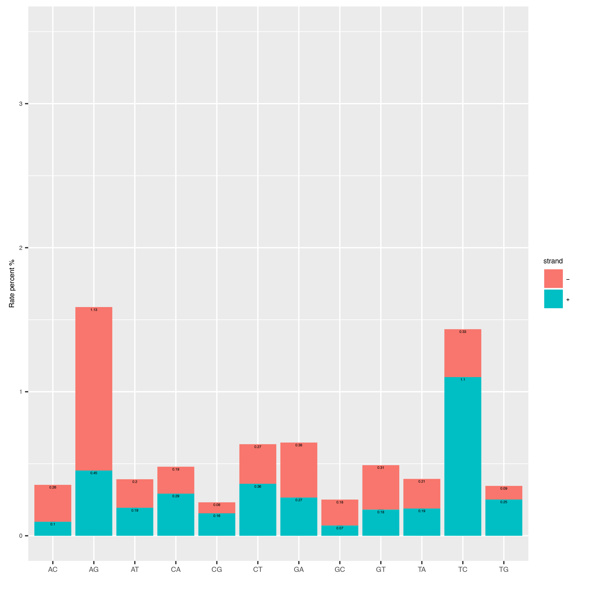
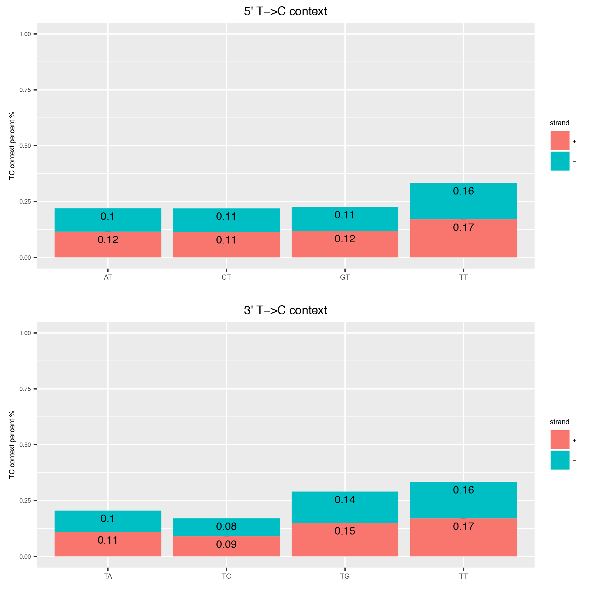

Alleyoop
========

*Alleyoop* (**A**\ dditional s\ **L**\ amdunk he\ **L**\ p\ **E**\ r tools for an\ **Y** diagn\ **O**\ stics **O**\ r **P**\ lots) is a collection of tools for post-processing and running diagnostics on *slamdunk* analyses.
Similar to *slamdunk*, the command line interface follows the "samtools/bwa" style. Meaning that all commands are available through the central executable/script *alleyoop* (located in the bin directory).

dedup
^^^^^

This tool allows you to deduplicate a given bam-file. While many tools like `Picard tools <https://broadinstitute.github.io/picard/>`_ already collapses
reads with same start and end position on the chromosome, *alleyoop* only collapses reads with same start and end position, mapping to the same strand and identical
read sequence.

.. code:: bash

    alleyoop dedup [-h] -o <output directory> [-t <threads>] bam [bam ...]
                
Input
"""""

===================  ========================================================================================================================================
File                 Description
===================  ========================================================================================================================================
**bam**              Fastq/BAM file(s) containing the final filtered reads from *slamdunk*. Can be multiple if multiple samples are analysed simultaneously.
===================  ========================================================================================================================================

Output
""""""
============================  ===========================================================================================================
File                          Description
============================  ===========================================================================================================
**Deduplicated BAM file**     One BAM file per sample containing the deduplicated reads. 
============================  ===========================================================================================================

Output files have the same name as the input files with the prefix "_dedup".
For example::
   
    34330_An312_wt-2n_mRNA-slamseq-autoquant_0h-R1.fq_slamdunk_mapped_filtered.bam -> 
    34330_An312_wt-2n_mRNA-slamseq-autoquant_0h-R1.fq_slamdunk_mapped_filtered_dedup.bam

Parameters
""""""""""
=========  ========  =====================================================================================================================================================================
Parameter  Required  Description
=========  ========  =====================================================================================================================================================================
**-h**               Prints the help.
**-o**     x         The output directory where all output files of this tool will be placed.
**-r**     x         The reference fasta file.
**-mq**              Minimum base quality for T->C conversions to be counted (default: 0).
**-t**               The number of threads to use. All tools run single-threaded, so it is recommended to use as many threads as available samples.  
**bam**    x         Fastq/BAM file(s) containing the final filtered reads. Can be multiple if multiple samples are analysed simultaneously.
=========  ========  =====================================================================================================================================================================

------------------------------------------------------ 

stats.rates
^^^^^^^^^^^

This tool computes the overall conversion rates in your reads and plots them as a barplot.

.. code:: bash

    alleyoop stats.rates [-h] -o <output directory> -r <reference fasta> [-mq <MQ cutoff>]
                         [-t <threads>] bam [bam ...]
                
Input
"""""

===================  ========================================================================================================================================
File                 Description
===================  ========================================================================================================================================
**Reference fasta**  The reference sequence of the genome to map against in fasta format.
**bam**              Fastq/BAM file(s) containing the final filtered reads from *slamdunk*. Can be multiple if multiple samples are analysed simultaneously.
===================  ========================================================================================================================================

Output
""""""
============================   ===========================================================================================================
File                           Description
============================   ===========================================================================================================
**overallrates.csv**           Tab-separated table of the overall conversion rates. 
**overallrates.csv**           Overall conversion rate plot file.
============================   ===========================================================================================================

Below is an example plot of the overall conversion rates of the reads in a sample. One can appreciate the typical excess of T->C conversion (A->G on minus strand)
of the SLAMSeq technology for later labelling timepoints.

Parameters
""""""""""
=========  ========  =====================================================================================================================================================================
Parameter  Required  Description
=========  ========  =====================================================================================================================================================================
**-h**               Prints the help.
**-o**     x         The output directory where all output files of this tool will be placed.
**-r**     x         The reference fasta file.
**-mq**              Minimum base quality for T->C conversions to be counted (default: 0).
**-t**               The number of threads to use. All tools run single-threaded, so it is recommended to use as many threads as available samples.  
**bam**    x         Fastq/BAM file(s) containing the final filtered reads. Can be multiple if multiple samples are analysed simultaneously.
=========  ========  =====================================================================================================================================================================

------------------------------------------------------

stats.TCcontext
^^^^^^^^^^^^^^^

This tool computes the genomic context of all Ts in a read and plots them as barplot to inspect any biases in that direction.

.. code:: bash

    alleyoop stats.TCcontext [-h] -o <output directory> -r <reference fasta> [-mq <MQ cutoff>]
                             [-t <threads>] bam [bam ...]
                
Input
"""""

===================  ========================================================================================================================================
File                 Description
===================  ========================================================================================================================================
**Reference fasta**  The reference sequence of the genome to map against in fasta format.
**bam**              BAM file(s) containing the final filtered reads from *slamdunk*. Can be multiple if multiple samples are analysed simultaneously.
===================  ========================================================================================================================================

Output
""""""
============================   ===========================================================================================================
File                           Description
============================   ===========================================================================================================
**tccontext.csv**              Tab-separated table of the 5' and 3' T-contexts, separated by strand.
**tccontext.pdf**              T-context plot file.
============================   ===========================================================================================================

Below is an example plot of the T-context of all reads in a sample. On top you will find the 5' context of individual Ts, at the bottom the respective 3' context of the individual Ts.
Note, that these will not be reciprocal (see e.g. `this publication <http://www.sciencedirect.com/science/article/pii/S0888754305002600>`_).

Parameters
""""""""""
=========  ========  =====================================================================================================================================================================
Parameter  Required  Description
=========  ========  =====================================================================================================================================================================
**-h**               Prints the help.
**-o**     x         The output directory where all output files of this tool will be placed.
**-r**     x         The reference fasta file.
**-mq**              Minimum base quality for T->C conversions to be counted (default: 0).
**-t**               The number of threads to use. All tools run single-threaded, so it is recommended to use as many threads as available samples.  
**bam**    x         BAM file(s) containing the final filtered reads. Can be multiple if multiple samples are analysed simultaneously.
=========  ========  =====================================================================================================================================================================

------------------------------------------------------

stats.utrrates
^^^^^^^^^^^^^^

This tool checks the individual conversion rates per 3'UTR and plots them as boxplots over the entire realm of 3'UTRs. Each conversion is normalized
to all possible conversions from it's starting base e.g. A->G / (A->A + A->G + A->C + A->T). 

.. code:: bash

    alleyoop stats.utrrates [-h] -o <output directory> [-r <reference fasta>] [-mq <MQ cutoff>]
                            [-t <threads>] -b <bed file> -l <maximum read length> bam [bam ...]
                
Input
"""""

===================  ========================================================================================================================================
File                 Description
===================  ========================================================================================================================================
**Reference fasta**  The reference sequence of the genome to map against in fasta format.
**-b**               Bed file with coordinates of 3'UTRs.
**bam**              BAM file(s) containing the final filtered reads from *slamdunk*. Can be multiple if multiple samples are analysed simultaneously.
===================  ========================================================================================================================================

Output
""""""
============================   ===========================================================================================================
File                           Description
============================   ===========================================================================================================
**mutationrates_utr.csv**      Tab-separated table with conversion reads, one UTR per line.
**mutationrates_utr.pdf**      UTR conversion rate plot file.
============================   ===========================================================================================================

Below is an example plot of conversion rates for all UTRs for a given sample. Typically, the individual conversions for a given starting
base are balanced and unbiased, except for T->C conversions in SLAMSeq samples with longer labelling times. 

.. image:: img/stats.utrrates.png
   :width: 600px

Parameters
""""""""""
=========  ========  =====================================================================================================================================================================
Parameter  Required  Description
=========  ========  =====================================================================================================================================================================
**-h**               Prints the help.
**-o**     x         The output directory where all output files of this tool will be placed.
**-r**     x         The reference fasta file.
**-mq**              Minimum base quality for T->C conversions to be counted (default: 0).
**-t**               The number of threads to use. All tools run single-threaded, so it is recommended to use as many threads as available samples.
**-b**     x         Bed file with coordinates of 3'UTRs.
**-l**               Maximum read length in all samples (will be automatically estimated if not set).
**bam**    x         BAM file(s) containing the final filtered reads. Can be multiple if multiple samples are analysed simultaneously.
=========  ========  =====================================================================================================================================================================

------------------------------------------------------

stats.summary
^^^^^^^^^^^^^

** TODO **

------------------------------------------------------

stats.tcperreadpos
^^^^^^^^^^^^^^^^^^

This tool calculates the individual mutation rates per position in a read treating T->C mutations separately. This plot can be used to search for biases
along reads. 

.. code:: bash

    alleyoop stats.tcperreadpos [-h] -r <reference fasta> [-s <SNP directory>]
                                [-l <maximum read length>] -o <output directory> [-mq <MQ cutoff>]
                                [-t <threads>] bam [bam ...]
                
Input
"""""

===================  ========================================================================================================================================
File                 Description
===================  ========================================================================================================================================
**Reference fasta**  The reference sequence of the genome to map against in fasta format.
**-s**               (optional) The called variants from the *snp* dunk to filter false-positive T->C conversions.
**bam**              BAM file(s) containing the final filtered reads from *slamdunk*. Can be multiple if multiple samples are analysed simultaneously.
===================  ========================================================================================================================================

Output
""""""
============================   ===========================================================================================================
File                           Description
============================   ===========================================================================================================
**tcperreadpos.csv**           Tab-separated table with mutation rates, one line per read position.
**tcperreadpos.pdf**           Plot of the mutation rates along the reads.
============================   ===========================================================================================================

Below is an example plot of mutation rates along all reads in a sample. Typically, one will see increasing error rates towards the end of a reads,
as for all Illumina reads. In addition, depending on how many bases were clipped from the 5' end of the reads, one will also observe higher error
rates in the beginning of the read as illustrated in the example plot. Finally, for SLAMSeq samples with longer labelling times, the overall T->C 
conversions in the bottom plot will begin to increase compared to the overall background in the top plot.

Parameters
""""""""""
=========  ========  =====================================================================================================================================================================
Parameter  Required  Description
=========  ========  =====================================================================================================================================================================
**-h**               Prints the help.
**-o**     x         The output directory where all output files of this tool will be placed.
**-r**     x         The reference fasta file.
**-mq**              Minimum base quality for T->C conversions to be counted (default: 0).
**-t**               The number of threads to use. All tools run single-threaded, so it is recommended to use as many threads as available samples.
**-s**               The called variants from the *snp* dunk to filter false-positive T->C conversions.
**-l**               Maximum read length in all samples (will be automatically estimated if not set).
**bam**    x         BAM file(s) containing the final filtered reads. Can be multiple if multiple samples are analysed simultaneously.
=========  ========  =====================================================================================================================================================================

------------------------------------------------------

stats.tcperutrpos
^^^^^^^^^^^^^^^^^

This tool calculates the individual mutation rates per position in an 3'UTR treating T->C mutations separately. This plot can be used to search for biases
along UTRs. Only most 3' 200bp of each UTR will be considered because: 
* Quantseq fragments are estimated have an average size of ~200bp
* This way, any dynamic binning biases can be avoided

.. code:: bash

   alleyoop stats.tcperutrpos [-h] -r <reference fasta> -b <bed file> [-s <SNP directory>] 
                              [-l <maximum read length>] -o <output directory> [-mq <MQ cutoff>]
                              [-t <threads>] bam [bam ...]
                
Input
"""""

===================  ========================================================================================================================================
File                 Description
===================  ========================================================================================================================================
**Reference fasta**  The reference sequence of the genome to map against in fasta format.
**-s**               (optional) The called variants from the *snp* dunk to filter false-positive T->C conversions.
**-b**               Bed file with coordinates of 3'UTRs.
**bam**              BAM file(s) containing the final filtered reads from *slamdunk*. Can be multiple if multiple samples are analysed simultaneously.
===================  ========================================================================================================================================

Output
""""""
============================   ===========================================================================================================
File                           Description
============================   ===========================================================================================================
**tcperutr.csv**               Tab-separated table with mutation rates, one line per UTR position.
**tcperutr.pdf**               Plot of the mutation rates along the UTRs.
============================   ===========================================================================================================

Below is an example plot of mutation rates along all UTRs in a sample. Typically, one will see increasing error rates towards the end of a UTRs.
For SLAMSeq samples with longer labelling times, the overall T->C conversions in the bottom plot will begin to increase compared to the overall background in the top plot. 

Parameters
""""""""""
=========  ========  =====================================================================================================================================================================
Parameter  Required  Description
=========  ========  =====================================================================================================================================================================
**-h**               Prints the help.
**-o**     x         The output directory where all output files of this tool will be placed.
**-r**     x         The reference fasta file.
**-b**     x         Bed file with coordinates of 3'UTRs.
**-mq**              Minimum base quality for T->C conversions to be counted (default: 0).
**-t**               The number of threads to use. All tools run single-threaded, so it is recommended to use as many threads as available samples.
**-s**               The called variants from the *snp* dunk to filter false-positive T->C conversions.
**-l**               Maximum read length in all samples (will be automatically estimated if not set).
**bam**    x         BAM file(s) containing the final filtered reads. Can be multiple if multiple samples are analysed simultaneously.
=========  ========  =====================================================================================================================================================================

------------------------------------------------------

stats.utrcoverage
^^^^^^^^^^^^^^^^^

** TODO **

------------------------------------------------------

dump.reads
^^^^^^^^^^

This tool outputs all available information calculated by *slamdunk* for each read in a sample.

.. code:: bash

   alleyoop dump.reads [-h] -r <reference fasta> [-s <SNP directory>] -o <output directory>
                       [-mq <MQ cutoff>] [-t <threads>] bam [bam ...]

                
Input
"""""

===================  ========================================================================================================================================
File                 Description
===================  ========================================================================================================================================
**Reference fasta**  The reference sequence of the genome to map against in fasta format.
**-s**               (optional) The called variants from the *snp* dunk to filter false-positive T->C conversions.
**bam**              BAM file(s) containing the final filtered reads from *slamdunk*. Can be multiple if multiple samples are analysed simultaneously.
===================  ========================================================================================================================================

Output
""""""
============================   ===========================================================================================================
File                           Description
============================   ===========================================================================================================
**readinfo.sdunk**             Tab-separated table with read info, one line per read
============================   ===========================================================================================================

The following columns are contained in the *readinfo* file:

** TODO: REVISE DESCRIPTION - DOES NOT SEEM TO BE UP TO DATE **

============================   ===========================================================================================================
Column                         Description
============================   ===========================================================================================================
Name                           Name of the read
Direction                      Read was mapped on forward (1) or reverse (2) strand
Sequence                       Sequence of the read
Mismatches                     Number of mismatches in the read
tCount                         Number of Ts in the read
tcCount                        Number of T->C conversion in the read
tcRate                         T->C conversion rate of the read
ConversionRates                List of all possible conversion in the read
============================   ===========================================================================================================

Parameters
""""""""""
=========  ========  =====================================================================================================================================================================
Parameter  Required  Description
=========  ========  =====================================================================================================================================================================
**-h**               Prints the help.
**-o**     x         The output directory where all output files of this tool will be placed.
**-r**     x         The reference fasta file.
**-mq**              Minimum base quality for T->C conversions to be counted (default: 0).
**-t**               The number of threads to use. All tools run single-threaded, so it is recommended to use as many threads as available samples.
**-s**               The called variants from the *snp* dunk to filter false-positive T->C conversions.
**bam**    x         BAM file(s) containing the final filtered reads. Can be multiple if multiple samples are analysed simultaneously.
=========  ========  =====================================================================================================================================================================

