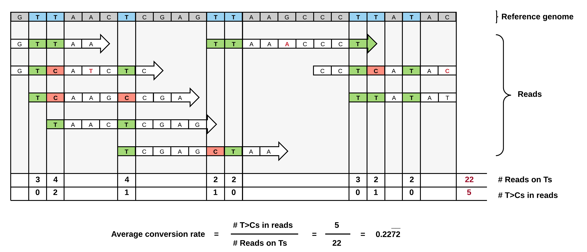

Basics
======

.. _conversionRates:

Conversion rates
^^^^^^^^^^^^^^^^

The individual measured conversion rates within a 3' UTR are highly dependent on the T-content of a given UTR and the number of reads that cover those Ts.
The more reads containing Ts, the more accurate the overall estimation of the conversion rate of T>Cs in this given 3' UTR will be.

We have adressed this by using a 3' UTR positions based view instead of a read based view: For each T-position in a given 3' UTR, we record
the number of reads covering this position and the number of reads with T>C conversion at this position - the more reads, the more accurate the T>C conversion rate estimation will be.

Both values are summed over all T-positions in the UTR - this way, less reliable T-positions with little reads will have lower impact on the overall T>C conversion rate estimation than
T-positions with many reads.   

   
**Note:** Since QuantSeq is a strand-specific assay, only sense reads will be considered for the final analysis!

Multimapper reconciliation
^^^^^^^^^^^^^^^^^^^^^^^^^^

Definition and importance
"""""""""""""""""""""""""

Multimappers are reads which align to more than one position in the genome with equal best alignment scores.

Such reads make up a substantial part of the alignment and are generally ignored, but can provide valuable information if they can be unequivocally
reassigned to a given location, enhancing the overall signal and thus heavily influencing the overall accuracy.

However, there are also several caveats: For genes with isoforms or homologous genes, simply taking all alignments into account will heavily distort
the signal, since the reads will likely not account equally for all regions, but rather originate mainly from a single region which cannot be unambiguously assigned. 

Reassignment strategy
"""""""""""""""""""""

We have settled for a very conservative multimapper reassignment strategy:

Since the QuantSeq technology specifically enriches for 3' UTRs, we only consider alignments to annotated 3' UTRs supplied to *slamdunk* as relevant.

Therefore, any multimappers with alignments to a single 3' UTR and non-3'UTR regions (i.e. not annotated in the supplied reference) will be unequivocally
assigned to the single 3'UTR. If there are multiple alignments to this single 3'UTR, one will be chosen at random.

For all other cases, were a read maps to several 3' UTRs, we are unable to reassign the read uniquely to a given 3'UTR and thus discard it from the analysis.

In short, the procedure is as follows, illustrated by the example below:

#. Create an `Interval Tree <https://pypi.python.org/pypi/intervaltree/2.0.4>`_ from the supplied 3' UTR annotation
#. Check the overlaps of all multimapping reads with 3' UTRs using the Interval Tree
#. Remove any reads with alignments to more than one single 3' UTR
#. Remove any additional alignments to non-UTR regions

.. image:: img/multimappers.png
   :width: 800px

.. _tcount-file:

Tcount file format
^^^^^^^^^^^^^^^^^^

The *tcount* file is the central output file of *slamdunk*. It contains all results, conversion rates and other statistics for each UTR which is the
main starting point for any subsequent analysis that will follow e.g. transcript half-life estimates or DE analysis.

*Tcount* files are essentially tab-separated text files containing one line entry per 3' UTR supplied by the user. Each entry contains the following
columns:

===============  ========  ===================================================================================
Column           Datatype  Description
===============  ========  ===================================================================================
chromosome       String    Chromosome on which the 3' UTR resides
start            Integer   Start position of the 3' UTR
end              Integer   End position of the 3' UTR
name             String    Name or ID of the 3' UTR supplied by the user
strand           String    Strand of the 3' UTR
conversionRate   Float     Average conversion rate (see :ref:`conversionRates`)
readsCPM         Float     Normalized number of reads as counts per million
coverageOnTs     Integer   Cumulative coverage on all Ts in the 3' UTR
conversionsOnTs  Integer   Cumulative number of T>C conversions in the 3' UTR
readCount        Integer   Number of reads aligning to the 3' UTR
tcReadCount      Integer   Number of reads with T>C conversions aligning to the 3' UTR
multimapCount    Integer   Number of reads considered as multimappers aligning to the 3' UTR
===============  ========  ===================================================================================

Here is an example:

.. code:: bash

   chr10    83761918  83762291  ENSMUSG00000087651      +        0.00563063063063        10.6160236544     1776     10       136      3        55
   chr10    83761918  83762761  ENSMUSG00000087651      +        0.00675324675325        21.9345782859     3850     26       281      11       55
   chr7     38194971  38195089  ENSMUSG00000054676      +        0.0      0.780589974586    111      0        10       0        0
   chr7     38194796  38197568  ENSMUSG00000054676      +        0.021164021164    6.01054280431     945      20       77       9        0
   chr16    8856039   8856689   ENSMUSG00000022507      +        0.00797607178465        7.7278407484      1003     8        99       4        0
   chr16    8856039   8858191   ENSMUSG00000022507      +        0.00889192886457        35.7510208361     5848     52       458      23       0
