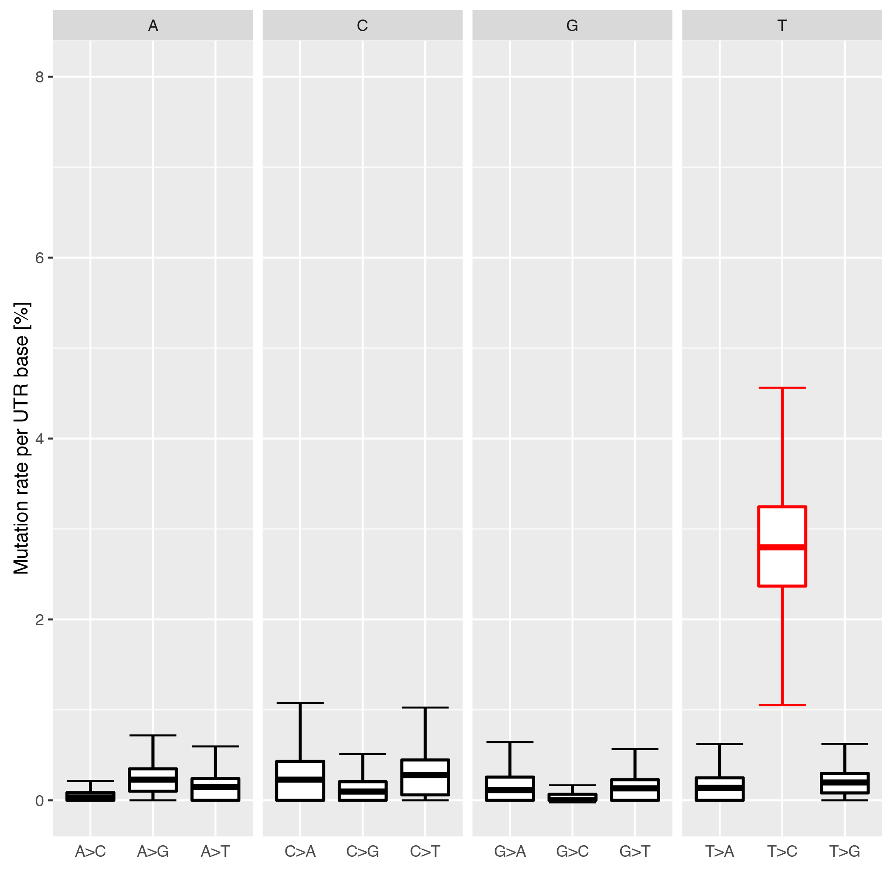

Quickstart
==========

To analyze a given SLAMSeq dataset with *slamdunk* using the default parameters which worked well on datasets during development,
call the *all* dunk using the recommended minimum set of default parameters:

.. code:: bash

    slamdunk all -r <reference fasta> -b <bed file> -o <output directory> -5 12 -n 100
                 -t <threads> -m -rl <maximum read length> bam [bam ...]
                 
The input data you need and parameters you need to set yourself are the following:
                 
=========  ==========================================================================================================================================================
Parameter  Description
=========  ==========================================================================================================================================================
**-r**     The reference fasta file.
**-b**     BED-file containing coordinates for 3' UTRs.
**-o**     The output directory where all output files of this dunk will be placed.
**-t**     The number of threads to use for this dunk. NextGenMap runs multi-threaded, so it is recommended to use more threads than available samples (default: 1).
**bam**    Fastq/BAM file(s) containing the raw unmapped reads. Can be multiple if multiple samples are analysed simultaneously.
=========  ==========================================================================================================================================================

This will run the entire *slamdunk* analysis with the most relevant output files being:

* Folder *count*: Tab-separated *tcount* files containing the SLAMSeq statistics per UTR (see :ref:`tcount-file`)
* Folder *filter*: BAM-files with the final mapped reads for visualization and further processing

------------------------------------------------------

If you want to have a very quick sanity check whether your desired conversion rates have been achieved, use this *alleyoop* command
to plot the UTR conversion rates in your sample:

.. code:: bash

   alleyoop stats.utrrates -o <output directory> -r <reference fasta> [-t <threads>]
                           -b <bed file> -l <maximum read length> bam [bam ...]
                

=========  =====================================================================================================================================================================
Parameter  Description
=========  =====================================================================================================================================================================
**-o**     The output directory where the plots will be placed.
**-r**     The reference fasta file.
**-t**     The number of threads to use. All tools run single-threaded, so it is recommended to use as many threads as available samples.
**-b**     BED-file containing coordinates for 3' UTRs.
**-l**     Maximum read length in all samples.
**bam**    BAM file(s) containing the final filtered reads from the *filter* folder. Can be multiple if multiple samples are analysed simultaneously.
=========  =====================================================================================================================================================================

This will produce a plot like the following example where you can clearly see that individual conversions for a given starting base are balanced and unbiased,
except for the T->C conversions in this SLAMSeq sample with longer labelling times. 

